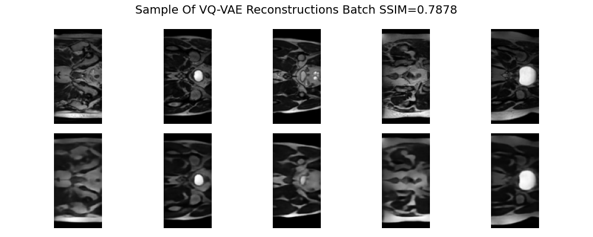
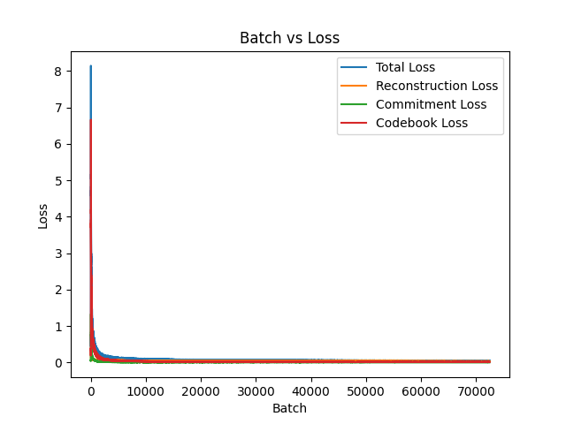
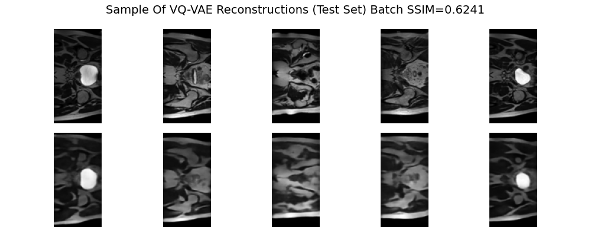
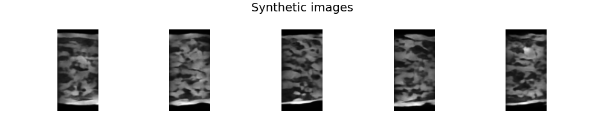

# Vector Quantisation Variational Auto Encoder

## Description of Vector Quantisation Variational Auto Encoder
A Vector Quantisation Variational Auto Encoder (VQ-VAE) is a model proposed by van den Oord et al. that incorporates the
idea of quantising encoder outputs into a discrete latent space into Variational Auto Encoders (VAEs) [1]. 
The encoder outputs are quantised by replacing them with the nearest discrete embedding in a learned codebook, this aims
to avoid the issue of posterior collapse, wherein the latent representations can be ignored if a powerful enough 
decoder is used [1]. To allow the discrete embeddings to be learned, a codebook loss and commitment loss are used. The 
codebook loss pulls the embeddings in the codebook closer to the encoder outputs quantised into that embedding while the
commitment loss pulls encoder outputs closer to the embeddings they are quantised into. 

## Description of Problem
A VQ-VAE was used on the HipMRIStudy prostate cancer radiotherapy 2D slices. The objective was to train a generative 
model on the dataset that could generate 'reasonably clear' images similar to those in the dataset. To achieve this, a 
VQ-VAE can be trained to encode the image in the dataset into a discrete, lower dimensional latent space and decode the 
latent representation to be as similar to the original image as possible. Reconstructed images were required to have a 
Structural Similarity Index Measure of over 0.6. 

The VQ-VAE model can then be used to generate synthetic images by generating, quantising, and decoding random encodings. 

## How it Works
Description of the training algorithm?

### Data Pre-processing
The data was pre-processed by resizing and cropping each image to 128x64 before normalising the data to be in range 
[0, 1]. The data was resized to reduce model size and complexity, allowing for faster training convergence. 
The data was normalised to [0, 1] so that a sigmoid activation function could be used as the final step in the 
decoder.

### Running Guide
#### Dependencies
The Python packages required for all scripts are listed in `requirements.txt`. They can be installed by running
```bash
pip3 install -r requirements.txt
```

#### Data
All scripts assume they will be run on the Rangpur cluster, so the dataset paths point to the location of the data on 
Rangpur. 

#### Plots
The training script creates plots every 5 epochs, they are saved in the `plots` subdirectory in the current working 
directory, it is assumed this directory exists.

#### Training
In an environment with the dependencies installed, the training algorithm can be run using the following command.
```bash
python3 train.py
```
This script will train a VQ-VAE model on the train dataset for 101 epochs before evaluating the performance of the 
model on the train set. During training, plots of originals against reconstructions of the train set will be saved every 
5 epochs to the `plots` subdirectory. At the conclusion of training a plot of the total, reconstruction, commitment, 
and codebook losses over the course of the training will be created and saved.

#### Inference
In an environment with the dependencies installed, a saved model can be loaded and used for inference. The `predict.py` 
script assumes there is a file in the current working directory named `vq-vae.model`, this is the model that will be 
used for inference. If this model file is present, the predict script can be run using the following command.
```bash
python3 predict.py
```
This script will generate and plot a sample of five synthetic images. The script will also encode, quantise, and decode 
all images in the dataset specified within the file, outputting the average reconstruction loss and average SSIM as well 
as a plot of original images against reconstructions.

## Results
When training was finished, the model was used to run an additional epoch of inference on the train set, the average 
Structural Similarity Index Measure (SSIM) of this epoch was 0.7843, and the average reconstruction loss was 0.0350.

A plot showing each type of loss for every batch while training can be found in Figure 2.

At the conclusion of training, the model was used to produce reconstructions on the test set in inference mode. The 
reconstructions can be found in Figure 3. The average SSIM on the test set was 0.6111, and the average reconstruction 
loss was 0.0589.

The model was also used to generate synthetic images by quantising and decoding randomly generated encodings. A sample
of five synthetic images can be found in Figure 4.

### Figures
#### Figure 1: Train Set Reconstructions After Training Finished

#### Figure 2: Plot Of Loss Of Each Training Batch

#### Figure 3: Test Set Reconstructions After Conclusion Of Training

#### Figure 4: Synthetic Images


## Reproducibility
Before the model starts training, seeds for inbuilt random and PyTorch random are set to a pre-determined value. 
Additionally, PyTorch is set to use deterministic algorithms to ensure that results are reproducible.

## References
[1] A. van den Oord, O. Vinyals, and K. Kavukcuoglu, “Neural Discrete Representation Learning,” arXiv.org, May 30, 2018.
https://arxiv.org/abs/1711.00937v2

[2] K. Rasul, “vq-vae.ipynb - Colab,” Google Colab, Nov. 14, 2019.
    https://colab.research.google.com/github/zalandoresearch/pytorch-vq-vae/blob/master/vq-vae.ipynb
    (accessed Oct. 29, 2025).